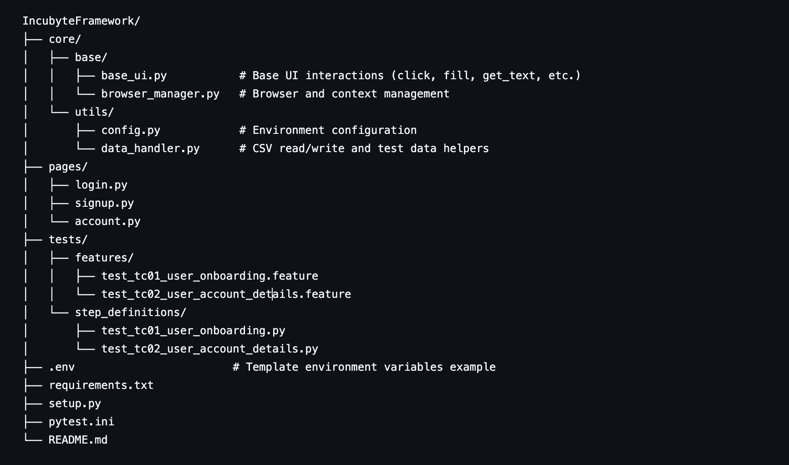

# Incubyte Automation Framework

A Python-based automation framework using **Playwright**, **Pytest**, and **Pytest-BDD** for end-to-end testing of web applications.

---

## **Framework Structure**





---

## **Setup Instructions**

### 1. Clone the Repository
```bash
git clone https://github.com/yourusername/IncubyteFramework.git
cd IncubyteFramework

### 2. Setup virtual environment

python3 -m venv venv
source venv/bin/activate      # Mac/Linux
venv\Scripts\activate         # Windows

### 3. Install dependencies

# Using setup.py
python3 -m pip install -e .

# Or using requirements.txt
python3 -m pip install -r requirements.txt

# Run all tests in the project
pytest

# Run all tests with output shown live (no output capture)
pytest -s

# Run all tests from a specific folder
pytest tests/

# Run a specific test file
pytest tests/step_definitions/test_tc01_user_onboarding.py -s

# Run tests matching a pattern (e.g., files starting with test_)
pytest -k "test"

# Run tests with detailed info and stop on first failure
pytest -v -x

# Run tests and generate HTML report
pytest --html=report.html

